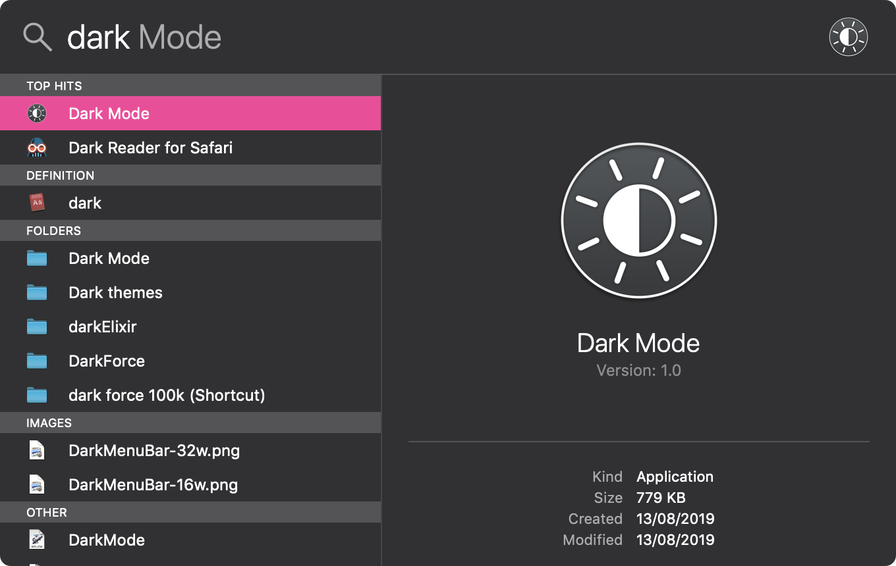

<div align="center">
  
	<h1>Dark Mode</h1>
	<p>
		Toggle the <b>macOS</b> dark mode from <b><a href="//support.apple.com/en-us/HT204014">Spotlight Search</a></b>
	</p>
	<br>
	<br>
	<br>
</div>

## Install

### Via :beer: [Homebrew Cask](//brew.sh)

```powershell
brew cask install dafuqtor/tap/darkmode
```

#### Direct Download · **[Latest Release](//github.com/DaFuqtor/DarkMode/releases/latest/download/DarkMode.zip) ([](//github.com/DaFuqtor/DarkMode/releases))**

<br>

<h2 align="right">:mag: Usage</h2>

<p align="right"><kbd>⌘</kbd><kbd>Space</kbd> &nbsp·&nbsp type <code>dark</code> &nbsp·&nbsp hit <kbd>Enter</kbd>&nbsp</p>



## Related

#### [Dynamic Dark Mode](//apollozhu.github.io/Dynamic-Dark-Mode/)

> The smart, automatic Dark Mode toggle for macOS **Mojave**

#### [dark-mode](//github.com/sindresorhus/dark-mode) binary

> Control the **macOS** dark mode from the command-line

#### [alfred-dark-mode](//github.com/sindresorhus/alfred-dark-mode)

> [Alfred](//www.alfredapp.com) workflow to toggle the system dark mode